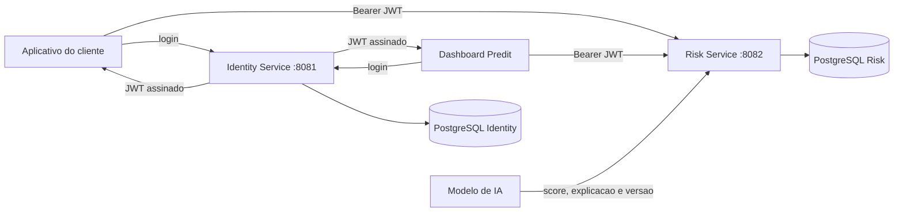
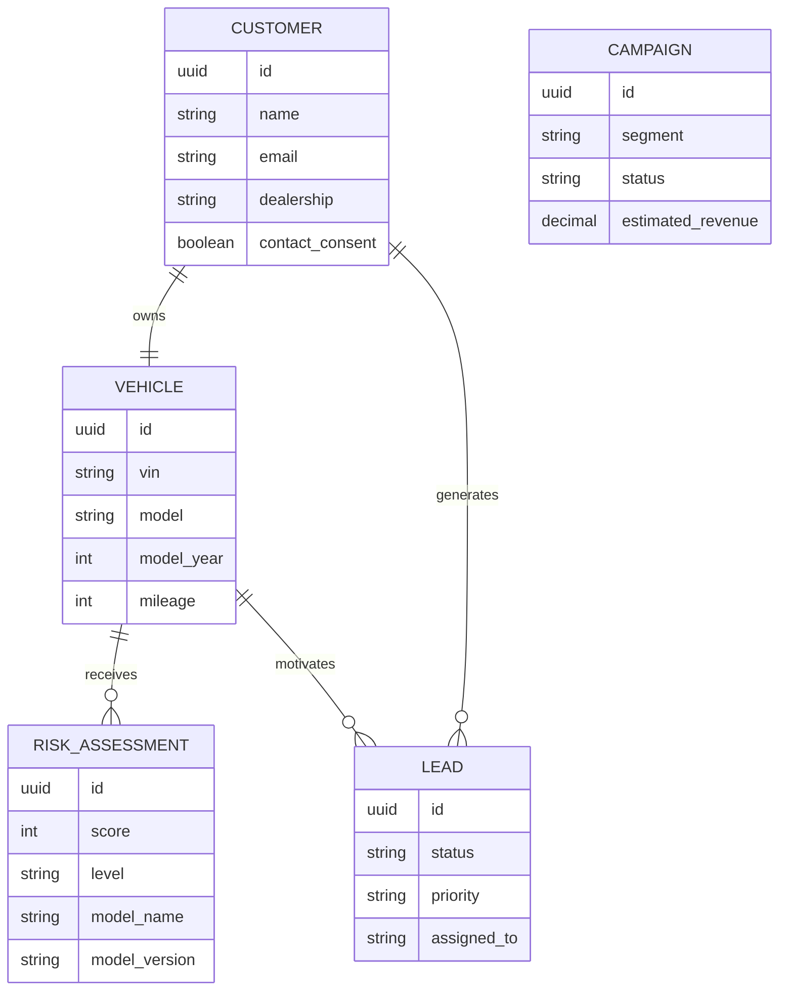

# Predit Backend

**Plataforma de inteligência para aumentar o VIN Share da Ford por meio de previsão de evasão, priorização de clientes e ações de retenção.**


Predit é o backend do dashboard gerencial apresentado no Ford Challenge. A solução consolida informações de clientes e veículos, recebe resultados de modelos preditivos e transforma risco de evasão em uma fila clara de trabalho para a concessionária.

O objetivo não e apenas mostrar quem apresenta risco. O sistema explica **por que o cliente está em risco**, indica **qual ação deve ser tomada** e permite acompanhar o resultado por meio de leads e campanhas.

> Este repositório corresponde a entrega de Sprint 3 da disciplina de Arquitetura Orientada a Serviços e Web Services da FIAP.

---

## Sumário

- [Contexto do projeto](#Contexto-do-projeto)
- [Solução proposta](#solução-proposta)
- [Funcionalidades](#Funcionalidades)
- [Arquitetura](#arquitetura)
- [Como a IA participa da solução](#como-a-ia-participa-da-solução)
- [Tecnologias](#tecnologias)
- [Modelo de domínio](#modelo-de-domínio)
- [Segurança e perfis de acesso](#Segurança-e-perfis-de-acesso)
- [Como executar com Docker](#como-executar-com-docker)
- [Como demonstrar o projeto](#como-demonstrar-o-projeto)
- [Endpoints](#endpoints)
- [Exemplos de requisição](#exemplos-de-requisição)
- [Erros e status HTTP](#erros-e-status-http)
- [Testes automatizados](#testes-automatizados)
- [Observabilidade](#observabilidade)
- [Pipeline DevSecOps](#pipeline-devsecops)
- [Estrutura do repositório](#estrutura-do-repositório)
- [Documentação complementar](#Documentação-complementar)
- [Solução de problemas](#solução-de-problemas)

---

## Contexto do projeto

VIN Share representa a parcela de veículos Ford que continua utilizando a rede oficial para manutenções e serviços. Quando um cliente deixa de retornar a concessionária, a rede perde receita de peças e mão de obra, reduz a oportunidade de relacionamento e pode comprometer a recompra futura.

O problema operacional e que os sinais de evasão ficam distribuidos entre histórico de revisoes, garantia, quilometragem, interações e comportamento de atendimento. Sem uma visão consolidada, a concessionária tende a agir apenas depois que o cliente já deixou a rede.

Predit organiza esses sinais em uma jornada proativa:

1. um modelo analítico calcula o risco associado ao VIN;
2. a API registra o score e os fatores explicativos;
3. o dashboard destaca clientes e modelos prioritários;
4. o gestor cria leads ou campanhas de retenção;
5. a equipe acompanha contato, conversão e impacto potencial.

## Solução proposta

A solução foi dividida em dois microserviços independentes:

| Serviço | Porta | Banco | Responsabilidade |
| --- | ---: | --- | --- |
| `identity-service` | `8081` | `predit_identity` | usuários, senhas, perfis, login e emissão de JWT |
| `risk-service` | `8082` | `predit_risk` | clientes, veículos, scores, dashboard, leads e campanhas |

Cada Serviço possui banco próprio e migrations independentes. O Risk Service não consulta tabelas do Identity Service: ele valida localmente a assinatura, o emissor, a expiração e os perfis presentes no JWT.

## Funcionalidades

- autenticação stateless com JWT de curta duração;
- controle de acesso por `ADMIN`, `MANAGER` e `ADVISOR`;
- cadastro de clientes e veículos identificados por VIN;
- histórico de avaliações preditivas com nome e versão do modelo;
- explicação dos fatores de risco e recomendação de próxima ação;
- filtros de clientes por risco, concessionária, nome, e-mail ou VIN;
- dashboard com VIN Share, veículos monitorados, risco medio e receita em risco;
- distribuição de risco e score medio por modelo;
- criação e acompanhamento de leads proativos;
- planejamento e ativacao de campanhas de retenção;
- validação de consentimento para ações de relacionamento;
- Documentação interativa com OpenAPI e Swagger UI;
- respostas de erro padronizadas com `application/problem+json`;
- logs JSON com correlation ID;
- métricas para Prometheus e health checks com Spring Actuator;
- migrations Flyway e dados ficticios para demonstração;
- Execução completa com Docker Compose;
- pipeline com testes e verificações de Segurança.

---

## Arquitetura



### Fluxo de autenticação

1. O usuário envia e-mail e senha para `POST /api/v1/auth/login`.
2. O Identity Service localiza o usuário e compara a senha com o hash BCrypt.
3. Um JWT HS256 e emitido com `sub`, `iss`, `iat`, `exp`, `email`, `name` e `roles`.
4. O cliente envia o token no header `Authorization: Bearer <token>`.
5. O Risk Service valida assinatura, emissor e expiração sem acessar o banco de identidade.
6. Spring Security aplica a regra do endpoint e do perfil autenticado.

### Separação de responsabilidades

| Camada | Responsabilidade |
| --- | --- |
| `api` | controllers, DTOs, validação de entrada e contrato HTTP |
| `service` | regras de negócio e coordenação dos casos de uso |
| `domain` | entidades, enums e repositories do domínio |
| `config` | Segurança, OpenAPI e configuração da aplicação |
| `security` | rate limit, correlation ID e apoio ao JWT |
| `error` | exceções de domínio e respostas RFC 9457 |
| `db/migration` | criação e evolução versionada do schema |

O detalhamento dos componentes e diagramas de sequência está em [docs/architecture.md](docs/architecture.md).

## Como a IA participa da solução

O modelo de machine learning fica desacoplado da API. Ele pode ser treinado e executado em Python, notebook ou plataforma de dados, desde que publique uma inferência no contrato do Risk Service.

Para cada veiculo, o modelo envia:

- `score`: probabilidade operacional de evasão, de 0 a 100;
- `reasons`: fatores que mais influenciaram a previsão;
- `recommendedAction`: ação sugerida para a concessionária;
- `modelName`: identificação do modelo;
- `modelVersion`: versão usada para auditoria e comparação.

O backend calcula a faixa de risco a partir do score, preserva o histórico da inferência e disponibiliza os dados para o dashboard. Dessa forma, um novo modelo pode substituir o anterior sem alterar os demais recursos da plataforma.

Importante: o score representa uma probabilidade para apoiar decisão humana. Ele não e tratado como certeza nem dispara contato automaticamente.

---

## Tecnologias

| Tecnologia | Uso no projeto |
| --- | --- |
| Java 21 | linguagem principal |
| Spring Boot 3.5.12 | base dos microserviços |
| Apache Tomcat 10.1.60 | servidor HTTP embutido com correcoes de Segurança |
| Spring Web | APIs REST |
| Spring Data JPA / Hibernate | persistência e repositories |
| Spring Security | autenticação e autorização |
| OAuth2 Resource Server | validação de Bearer JWT |
| JJWT | emissão de tokens no Identity Service |
| Jakarta Validation | validação de payloads |
| PostgreSQL 17 | bancos dos serviços em Docker |
| Flyway | versionamento do schema e seed de demonstração |
| H2 | testes e perfil local alternativo |
| Springdoc OpenAPI | Swagger UI e contrato OpenAPI |
| Spring Actuator | health, métricas e informações operacionais |
| Micrometer Prometheus | exposição de métricas do Risk Service |
| Logstash Encoder | logs estruturados em JSON |
| JUnit 5 / MockMvc | testes automatizados |
| Maven | build multi-modulo e dependências |
| Docker / Compose | empacotamento e orquestração local |
| GitHub Actions | integração continua e DevSecOps |

## Modelo de domínio



As campanhas representam estratégias por segmento e não dependem de um único cliente. Os dados de demonstração incluem Ranger, Bronco, Maverick, Mustang e Territory em diferentes faixas de risco.

---

## Segurança e perfis de acesso

### Perfis

| Operação | ADMIN | MANAGER | ADVISOR |
| --- | :---: | :---: | :---: |
| consultar dashboard, clientes, leads e campanhas | sim | sim | sim |
| criar usuários | sim | não | não |
| cadastrar cliente e veiculo | sim | sim | não |
| registrar inferência do modelo | sim | sim | não |
| criar lead | sim | sim | não |
| atualizar status de lead | sim | sim | sim |
| criar ou ativar campanha | sim | sim | não |

### Controles implementados

- senhas com BCrypt fator 12;
- JWT HS256 com emissor e expiração de 30 minutos;
- API stateless, sem sessão de servidor;
- autorização por endpoint e por método com `@PreAuthorize`;
- CORS com origens permitidas por configuração;
- CSP, bloqueio de frames e headers seguros;
- rate limit por origem;
- validação de tamanho, formato, e-mail, VIN e limites numéricos;
- mensagens de autenticação sem expor detalhes internos;
- segredos e senhas recebidos por variáveis de ambiente;
- containers executados por usuário sem privilégios;
- filesystem dos containers em modo somente leitura;
- logs sem senha ou token;
- consentimento registrado para campanhas de relacionamento.

A análise STRIDE, o mapeamento OWASP/LGPD e o plano de resposta a incidentes estão em [docs/security.md](docs/security.md).

---

## Como executar com Docker

### 1. Pré-requisitos

- Git;
- Docker Desktop com Docker Compose;
- Java 21 apenas se quiser compilar e executar os testes fora do Docker.

Confirme as instalações:

```powershell
docker version
docker compose version
```

### 2. Clonar o repositório

```powershell
git clone https://github.com/brunacostaz/Predit.git
cd Predit
```

### 3. Configurar variáveis

Crie o arquivo `.env` a partir do exemplo:

```powershell
Copy-Item .env.example .env
```

Variáveis disponíveis:

| Variável | Finalidade | Valor local de exemplo |
| --- | --- | --- |
| `JWT_SECRET` | chave compartilhada para assinar e validar JWT | mínimo de 32 caracteres |
| `ADMIN_EMAIL` | e-mail do administrador inicial | `admin@predit.com.br` |
| `ADMIN_PASSWORD` | senha inicial do administrador | `ChangeMe123!` |
| `IDENTITY_DB_PASSWORD` | senha do banco de identidade | `identity_dev_password` |
| `RISK_DB_PASSWORD` | senha do banco de risco | `risk_dev_password` |
| `VIN_SHARE_PERCENT` | indicador de referencia do dashboard | `68.0` |

Os valores padrão existem somente para demonstração local. Troque todos os segredos antes de qualquer ambiente compartilhado.

### 4. Opcional: executar os testes localmente

```powershell
.\mvnw.cmd clean verify
```

Esse passo exige Java 21, mas não e necessário para subir o Compose. Os Dockerfiles fazem o build em uma etapa isolada e copiam somente o JAR para a imagem final.

Os JARs locais sao gerados em:

```text
identity-service/target/identity-service-1.0.0.jar
risk-service/target/risk-service-1.0.0.jar
```

### 5. Subir o ambiente

```powershell
docker compose up --build -d
```

O Compose cria quatro containers:

- PostgreSQL do Identity Service;
- PostgreSQL do Risk Service;
- Identity Service;
- Risk Service.

Confira o estado:

```powershell
docker compose ps
docker compose logs -f identity-service risk-service
```

### 6. Acessar os recursos

| Recurso | URL |
| --- | --- |
| Identity Swagger | `http://localhost:8081/swagger-ui.html` |
| Identity OpenAPI | `http://localhost:8081/v3/api-docs` |
| Identity Health | `http://localhost:8081/actuator/health` |
| Risk Swagger | `http://localhost:8082/swagger-ui.html` |
| Risk OpenAPI | `http://localhost:8082/v3/api-docs` |
| Risk Health | `http://localhost:8082/actuator/health` |
| Risk Prometheus | `http://localhost:8082/actuator/prometheus` |

### 7. Encerrar o ambiente

```powershell
docker compose down
```

Para também apagar os volumes e reiniciar os dados ficticios:

```powershell
docker compose down -v
```

### Alternativa sem Docker

O perfil `demo` usa H2 em memória. Abra dois terminais na raiz:

```powershell
.\mvnw.cmd -pl identity-service spring-boot:run "-Dspring-boot.run.profiles=demo"
```

```powershell
.\mvnw.cmd -pl risk-service spring-boot:run "-Dspring-boot.run.profiles=demo"
```

---

## Como demonstrar o projeto

### Credencial inicial

```text
Email: admin@predit.com.br
Senha: ChangeMe123!
Perfil: ADMIN
```

### Fluxo recomendado no Swagger

1. Abra o Swagger do Identity Service.
2. Execute `POST /api/v1/auth/login` com a Credencial inicial.
3. Copie o campo `accessToken` da resposta.
4. Abra o Swagger do Risk Service e clique em **Authorize**.
5. Informe `Bearer <accessToken>`.
6. Execute `GET /api/v1/dashboard/summary` para mostrar os indicadores.
7. Execute `GET /api/v1/customers?riskLevel=CRITICAL` para localizar clientes prioritários.
8. Abra um cliente e mostre score, explicação, ação e versão do modelo.
9. Consulte `GET /api/v1/leads` e atualize um lead com `PATCH`.
10. Consulte `GET /api/v1/campaigns` e ative uma campanha.

O arquivo [http/predit-api.http](http/predit-api.http) contém o mesmo roteiro pronto para IntelliJ IDEA ou VS Code com REST Client.

---

## Endpoints

### Identity Service

| Método | Endpoint | Acesso | Status de sucesso | Finalidade |
| --- | --- | --- | ---: | --- |
| `POST` | `/api/v1/auth/login` | público | `200` | autenticar e emitir JWT |
| `GET` | `/api/v1/users` | ADMIN | `200` | listar usuários internos |
| `POST` | `/api/v1/users` | ADMIN | `201` | criar usuário e definir perfil |

### Risk Service

| Método | Endpoint | Acesso | Status de sucesso | Finalidade |
| --- | --- | --- | ---: | --- |
| `GET` | `/api/v1/dashboard/summary` | todos | `200` | consolidar indicadores do dashboard |
| `GET` | `/api/v1/customers` | todos | `200` | listar e filtrar clientes |
| `GET` | `/api/v1/customers/{id}` | todos | `200` | detalhar cliente, veiculo e risco atual |
| `POST` | `/api/v1/customers` | ADMIN, MANAGER | `201` | cadastrar cliente e veiculo |
| `POST` | `/api/v1/customers/{customerId}/vehicles/{vehicleId}/risk-assessments` | ADMIN, MANAGER | `201` | registrar inferência do modelo |
| `GET` | `/api/v1/leads` | todos | `200` | listar oportunidades priorizadas |
| `POST` | `/api/v1/leads` | ADMIN, MANAGER | `201` | criar lead proativo |
| `PATCH` | `/api/v1/leads/{id}/status` | todos | `200` | atualizar andamento e responsável |
| `GET` | `/api/v1/campaigns` | todos | `200` | listar campanhas de retenção |
| `POST` | `/api/v1/campaigns` | ADMIN, MANAGER | `201` | planejar campanha |
| `PATCH` | `/api/v1/campaigns/{id}/status` | ADMIN, MANAGER | `200` | alterar estado da campanha |

Filtros de clientes:

```text
GET /api/v1/customers?riskLevel=CRITICAL
GET /api/v1/customers?dealership=Ford%20Lapa
GET /api/v1/customers?query=Ranger
```

---

## Exemplos de requisição

### Login

```json
{
  "email": "admin@predit.com.br",
  "password": "ChangeMe123!"
}
```

Resposta resumida:

```json
{
  "accessToken": "eyJ...",
  "tokenType": "Bearer",
  "expiresAt": "2026-09-27T20:00:00Z",
  "user": {
    "name": "Predit Administrator",
    "email": "admin@predit.com.br",
    "role": "ADMIN"
  }
}
```

### Cadastro de cliente e veículo

```json
{
  "name": "Juliana Martins",
  "email": "juliana@example.com",
  "phone": "+5511999999999",
  "dealership": "Ford Lapa",
  "contactConsent": true,
  "vin": "1FTER4FH0RLE12345",
  "model": "Ranger",
  "modelYear": 2025,
  "mileage": 18400,
  "warrantyEndDate": "2028-03-15",
  "lastServiceDate": "2026-01-10"
}
```

### Registro de inferência

```json
{
  "score": 82,
  "reasons": "Revisao vencida, baixa recorrencia e garantia proxima do fim",
  "recommendedAction": "Priorizar contato e reservar uma janela de revisao",
  "modelName": "predit-retention-model",
  "modelVersion": "1.0.0"
}
```

Faixas geradas pelo backend:

| Score | Nível |
| ---: | --- |
| `0-39` | `LOW` |
| `40-59` | `MEDIUM` |
| `60-79` | `HIGH` |
| `80-100` | `CRITICAL` |

### Criação de lead

```json
{
  "customerId": "11111111-1111-1111-1111-111111111111",
  "vehicleId": "aaaaaaaa-aaaa-aaaa-aaaa-aaaaaaaaaaa1",
  "title": "Garantia em risco",
  "action": "Explicar o impacto da revisao atrasada e reservar horario",
  "priority": "CRITICAL",
  "dueAt": "2026-09-29T12:00:00Z"
}
```

### Atualização de lead

```json
{
  "status": "CONTACTED",
  "assignedTo": "consultor@predit.com.br"
}
```

### Criação de campanha

```json
{
  "name": "Revisao antes da viagem",
  "description": "Contato preventivo para clientes com revisao proxima",
  "segment": "Ranger com score acima de 60",
  "consentRequired": true,
  "eligibleCustomers": 42,
  "estimatedConversionRate": 18.5,
  "estimatedRevenue": 99960.00
}
```

---

## Erros e status HTTP

A API usa os métodos e status do Nível 2 de maturidade REST:

| Status | Quando ocorre |
| ---: | --- |
| `200 OK` | consulta ou Atualização concluída |
| `201 Created` | recurso criado com header `Location` |
| `400 Bad Request` | payload inválido ou regra de formato violada |
| `401 Unauthorized` | token ausente, inválido ou expirado |
| `403 Forbidden` | perfil autenticado sem permissão |
| `404 Not Found` | recurso inexistente |
| `409 Conflict` | e-mail, VIN ou regra unica em conflito |
| `429 Too Many Requests` | limite de requisições excedido |

Exemplo `application/problem+json`:

```json
{
  "type": "https://predit.com.br/problems/400",
  "title": "Validation failed",
  "status": 400,
  "detail": "One or more fields are invalid",
  "errors": {
    "name": "must not be blank"
  }
}
```

---

## Testes automatizados

Execute toda a verificação:

```powershell
.\mvnw.cmd clean verify
```

Cobertura funcional atual:

- login correto e emissão de JWT;
- validação de claims, perfil e expiração;
- credenciais invalidas;
- payload inválido;
- acesso anonimo ao dashboard;
- consulta autenticada dos indicadores;
- permissão de MANAGER para criar cliente;
- bloqueio de ADVISOR na mesma Operação;
- criação autorizada de campanha;
- bloqueio de campanha por perfil;
- campanha inválida e recurso inexistente;
- aplicação integral das migrations Flyway.

Resultado validado em 27/09/2026: **12 testes, 0 falhas e 0 erros**.

Relatórios:

```text
identity-service/target/surefire-reports
risk-service/target/surefire-reports
```

Veja a matriz completa em [docs/test-evidence.md](docs/test-evidence.md).

## Observabilidade

Os serviços geram logs JSON adequados para coleta por ferramentas como Grafana Loki, Elastic Stack ou Azure Monitor. O Risk Service aceita ou cria o header `X-Correlation-ID`, devolve o identificador na resposta e o inclui nos logs.

Sinais disponíveis:

- disponibilidade via `/actuator/health`;
- métricas JVM e HTTP via Actuator;
- endpoint Prometheus no Risk Service;
- falhas de autenticação e autorização;
- eventos de criação e alteração de leads e campanhas;
- headers de limite e saldo de requisições.

## Pipeline DevSecOps

O workflow `.github/workflows/ci.yml` executa em push para `main`, `develop` e pull requests:

1. build e testes com Java 21;
2. publicação dos Relatórios Surefire;
3. Gitleaks para secret scanning;
4. Semgrep para SAST;
5. Trivy para dependências e configurações;
6. build das duas imagens Docker;
7. scan de vulnerabilidades críticas nas imagens.

O pipeline falha quando encontra erro de teste ou vulnerabilidade acima do limite configurado.

---

## Estrutura do repositório

```text
Predit/
|-- .github/workflows/ci.yml
|-- docs/
|   |-- architecture.md
|   |-- rubric.md
|   |-- security.md
|   `-- test-evidence.md
|-- http/predit-api.http
|-- identity-service/
|   |-- src/main/java/br/com/fiap/predit/identity/
|   |-- src/main/resources/db/migration/
|   |-- src/test/
|   |-- Dockerfile
|   `-- pom.xml
|-- risk-service/
|   |-- src/main/java/br/com/fiap/predit/risk/
|   |-- src/main/resources/db/migration/
|   |-- src/test/
|   |-- Dockerfile
|   `-- pom.xml
|-- .env.example
|-- compose.yaml
|-- pom.xml
`-- README.md
```

## Documentação complementar

| Documento | Conteúdo |
| --- | --- |
| [Arquitetura](docs/architecture.md) | componentes, responsabilidades e fluxos de autenticação e predição |
| [Segurança](docs/security.md) | controles, STRIDE, LGPD, observabilidade e resposta a incidentes |
| [Mapa da rubrica](docs/rubric.md) | requisito da Sprint 3, Evidência no código e forma de demonstrar |
| [Evidência de testes](docs/test-evidence.md) | cenários automatizados e resultado da última Execução |
| [Coleção HTTP](http/predit-api.http) | requisições prontas para demonstração |

## Solução de problemas

### `docker` não é reconhecido

Abra o Docker Desktop e reinicie o terminal para atualizar o `PATH`. Confirme com `docker version`.

### Porta 8081 ou 8082 ocupada

Identifique o processo:

```powershell
Get-NetTCPConnection -LocalPort 8081,8082 -ErrorAction SilentlyContinue
```

Encerre o processo responsável ou altere o mapeamento de portas no `compose.yaml`.

### Banco não fica saudável

Consulte os logs:

```powershell
docker compose logs identity-db risk-db
```

Para recriar os bancos locais:

```powershell
docker compose down -v
docker compose up --build -d
```

### Token retorna 401

Confirme que:

- o header usa `Bearer` antes do token;
- o token não expirou;
- os dois serviços usam o mesmo `JWT_SECRET`;
- o issuer e `predit-identity`.

### Endpoint retorna 403

O token e válido, mas o perfil não possui permissão. Consulte a [matriz de acesso](#perfis).

---
