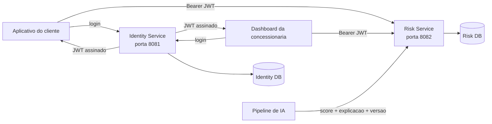
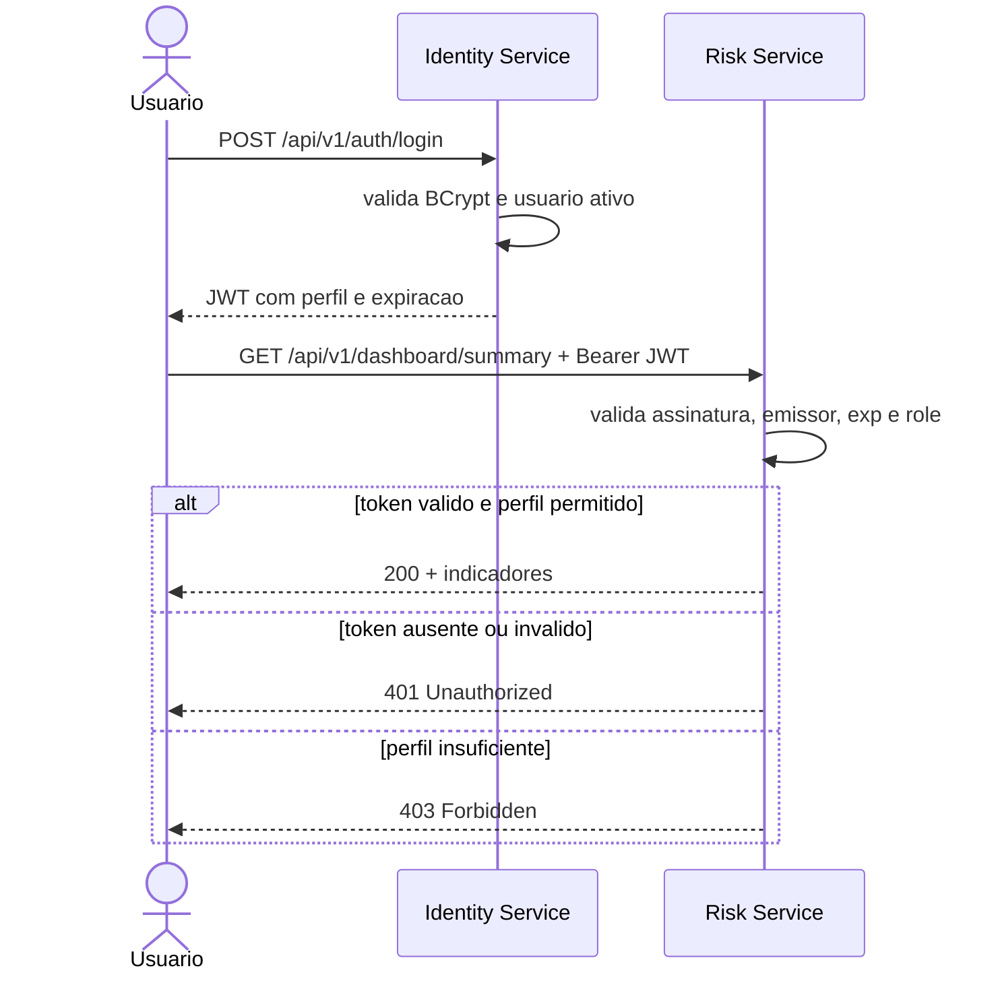

# Arquitetura da solucao

## Componentes e responsabilidades

### Identity Service

- cadastra usuarios internos da plataforma;
- aplica BCrypt nas senhas;
- autentica credenciais;
- emite JWT com `sub`, `iss`, `iat`, `exp`, `email`, `name` e `roles`;
- limita tentativas e protege o gerenciamento de usuarios com o perfil `ADMIN`.

### Risk Service

- mantem clientes e veiculos identificados por VIN;
- registra cada avaliacao preditiva e a versao do modelo;
- explica os fatores de risco e a proxima melhor acao;
- organiza leads para consultores e campanhas consentidas;
- agrega os indicadores usados pelo dashboard: VIN Share, veiculos monitorados, clientes em risco, leads, receita em risco e risco por modelo.

### Bancos de dados

Cada servico e dono de seus dados. O banco de identidade nao e compartilhado com o dominio de risco. As estruturas sao versionadas por Flyway e podem evoluir independentemente.

## Fluxo de autenticacao e autorizacao

## Fluxo da previsao ate a acao

1. O pipeline analitico combina historico de revisoes, garantia, engajamento e sinais permitidos pela finalidade do projeto.
2. O modelo produz um score, fatores explicativos, acao recomendada, nome e versao.
3. O `risk-service` valida e registra a avaliacao vinculada ao VIN.
4. Um gestor transforma o risco em lead ou campanha.
5. O consultor atualiza o andamento do lead.
6. O dashboard mede volume em risco, conversoes e evolucao do VIN Share.

O backend nao afirma que o score e uma certeza. Ele registra uma probabilidade operacional e preserva a explicabilidade e a rastreabilidade da versao do modelo.

## Decisoes de arquitetura

- **REST nivel 2:** URLs orientadas a recursos, verbos HTTP adequados e status coerentes.
- **Stateless:** nenhum servico mantem sessao; o contexto de acesso viaja no JWT.
- **Bancos separados:** reduz acoplamento e evita acesso cruzado aos dados de credenciais.
- **Modelo desacoplado:** o algoritmo pode evoluir sem alterar os contratos do dashboard.
- **Observabilidade:** correlation ID, logs JSON, health check e metricas Prometheus.
